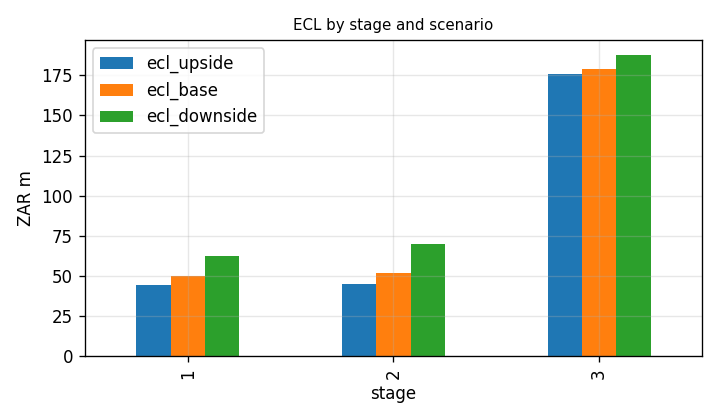
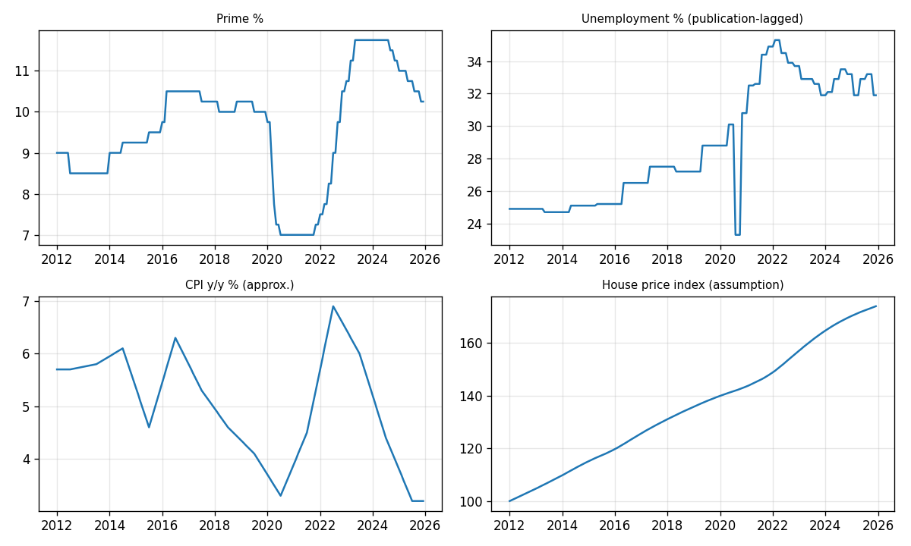
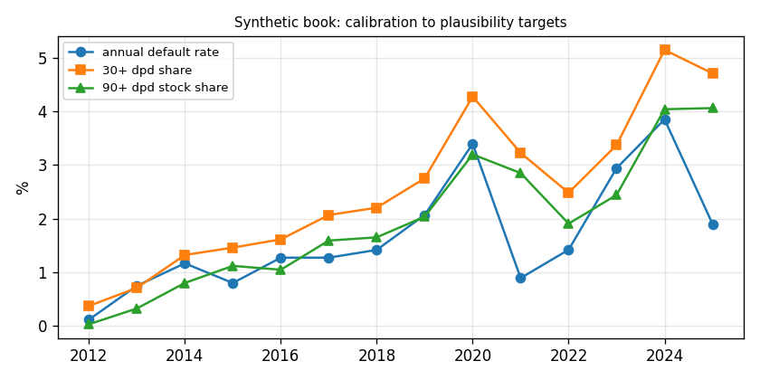
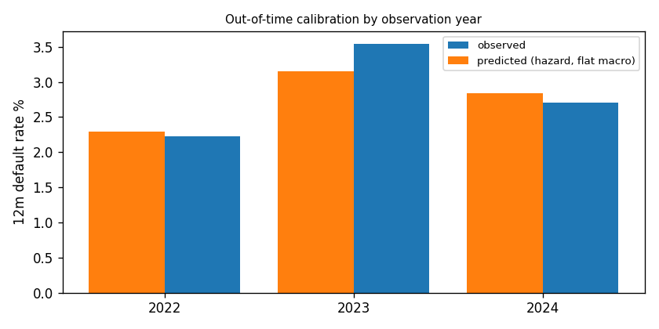
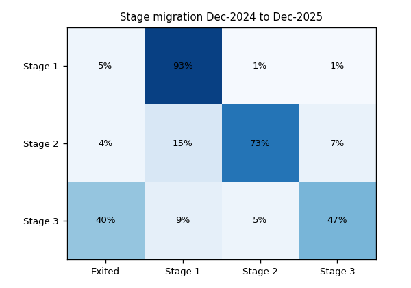
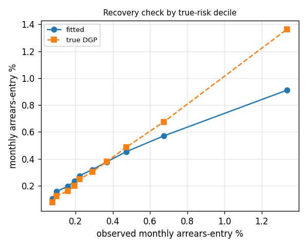

# IFRS 9 Expected Credit Loss engine: South African home-loan book

### Note: We reading some documentation and building🙂and We will build daily, from ground up. This project is been ongoing as I am researching and implementing. And I try to link what I have implemented in coding with the charts produced and the scripts producing the content on this repo

---

> ## ⚠️ Synthetic data alert🙂
> No public loan-level South African mortgage data exists, so the portfolio is **simulated with a known default and recovery process**
> ([`src/generator.py`](src/generator.py), parameters in [`config.yaml`](config.yaml)). Macro inputs are real SA series **or flagged approximations**
> ([`docs/data_lineage.csv`](docs/data_lineage.csv)). Results demonstrate **methodology, not real South African credit risk.**

An end-to-end IFRS 9 impairment engine for a prime-linked, 20-year residential mortgage book: synthetic portfolio, PD / LGD / EAD models, staging,
three macro scenarios, probability-weighted ECL, management overlay, independent-style validation, monitoring dashboard, tests and CI.
Full methodology: [`docs/Model_Development_Document.md`](docs/Model_Development_Document.md).

---

## Headline results (reporting date Dec-2025, 30,000 loans originated 2012-2024, seed 20251231)

Source: [`outputs/results.json`](outputs/results.json), [`outputs/ecl_by_stage.csv`](outputs/ecl_by_stage.csv)

| Metric | Result | File |
|---|---|---|
| Open loans / gross exposure | 20,939 loans / ZAR 24.3bn | [`results.json`](outputs/results.json) |
| **Total ECL (weighted + overlay)** | **ZAR 289.7m, 1.19% coverage** | [`ecl_by_stage.csv`](outputs/ecl_by_stage.csv) |
| ECL by scenario: upside / base / downside | ZAR 265m / 281m / 320m | [`ecl_by_scenario.csv`](outputs/ecl_by_scenario.csv) |
| Scenario weights (**illustrative**) | 50% base / 20% upside / 30% downside | [`config.yaml`](config.yaml) |
| 12m PD Gini, out-of-time 2023-24 | Hazard **0.646**, scorecard 0.617, GBM 0.617 | [`validation_discrimination.csv`](outputs/validation_discrimination.csv) |
| 12m PD KS, out-of-time | 0.488 / 0.463 / 0.466 | same |
| Calibration (predicted vs observed 12m PD) | 2022: 2.29% vs 2.23%; 2023: 3.15% vs 3.54%; 2024: 2.84% vs 2.71% | [`validation_calibration_year.csv`](outputs/validation_calibration_year.csv) |
| LGD backtest (predicted vs realised, post-2022) | 21.6% vs 21.4% | [`validation_lgd_backtest.csv`](outputs/validation_lgd_backtest.csv) |
| Cure-rate backtest | 22.4% predicted vs 24.5% observed | [`results.json`](outputs/results.json) |
| 6-month loss backtest (predicted / realised) | **0.82**: model under-predicts | [`validation_ecl_backtest.csv`](outputs/validation_ecl_backtest.csv) |
| Recovery check: fitted vs true risk (Spearman) | 0.89 | [`validation_recovery_coefficients.csv`](outputs/validation_recovery_coefficients.csv) |

### ECL by stage
| Stage | Loans | Exposure (ZAR) | ECL (ZAR) | Coverage |
|---|---|---|---|---|
| 1 | 18,057 | 20.17bn | 52.7m | 0.26% |
| 2 | 1,967 | 2.92bn | 56.1m | 1.92% |
| 3 | 915 | 1.25bn | 180.9m | 14.44% |
| **Total** | **20,939** | **24.34bn** | **289.7m** | **1.19%** |

Also by LTV band ([`ecl_by_ltv_band.csv`](outputs/ecl_by_ltv_band.csv)), score band ([`ecl_by_score_band.csv`](outputs/ecl_by_score_band.csv)) and loan ([`ecl_by_loan.csv.gz`](outputs/ecl_by_loan.csv.gz)).



---

## Figures

**Macro inputs** ([`src/macro.py`](src/macro.py) → [`data/processed/macro_monthly.csv`](data/processed/macro_monthly.csv)). Unemployment is publication-lagged by 2 months to avoid look-ahead.



**Calibration of the synthetic book** to plausibility targets ([`calibration_by_year.csv`](outputs/calibration_by_year.csv)): ~1-2% annual default in normal years, 3.4% in the 2020 stress, 3-4% in the 2023-24 hiking cycle.



**Out-of-time calibration** of the 12m PD ([`validation_calibration_year.csv`](outputs/validation_calibration_year.csv), by band: [`validation_calibration_band.csv`](outputs/validation_calibration_band.csv), by vintage: [`validation_calibration_vintage.csv`](outputs/validation_calibration_vintage.csv)).



**Stage migration** Dec-2024 → Dec-2025 ([`stage_migration_pct.csv`](outputs/stage_migration_pct.csv), counts: [`stage_migration_counts.csv`](outputs/stage_migration_counts.csv)). 93% of Stage 1 stays; 40% of Stage 3 exits (cure, sale or write-off).



**Recovery check**: the fitted hazard model against the *true* simulated process, by true-risk decile ([`validation_recovery_deciles.csv`](outputs/validation_recovery_deciles.csv)).



---

## Method in brief
([`src/`](src/) module in brackets)

| Component | Approach |
|---|---|
| Synthetic portfolio | Monthly delinquency chain (current, 30, 60, 90+) driven by bureau score, affordability, current LTV, employment, seasoning hump, unemployment, prime payment shock, 2020 shock, hidden AR(1) factor; cures; sale-in-execution recoveries over 9-30 months ([`generator.py`](src/generator.py)) |
| Features | Single feature definition for training and projection; macro lagged to availability ([`features.py`](src/features.py)) |
| 12m / lifetime PD | Multi-state discrete-time hazard (roll-rate) model, three logistic transitions; PD = probability mass reaching default along the loan's contractual path and macro scenario ([`pd_model.py`](src/pd_model.py), [`projection.py`](src/projection.py)) |
| Benchmark / challenger | WoE logistic scorecard; gradient boosting ([`pd_model.py`](src/pd_model.py); bins and IV: [`scorecard_woe_bins.csv`](outputs/scorecard_woe_bins.csv), [`scorecard_iv.csv`](outputs/scorecard_iv.csv)) |
| LGD | (1 − P(cure)) × loss-given-no-cure; point-in-time; recoveries discounted at EIR ([`lgd.py`](src/lgd.py)) |
| EAD | Contractual amortisation at the prime-linked rate; prepayment applied in survival ([`ead.py`](src/ead.py)) |
| Staging | 30+ dpd backstop; SICR = 12m PD ≥ 2.5× origination **and** +0.5pp; Stage 3 = 90+ dpd or 12-month cure probation ([`staging.py`](src/staging.py), thresholds in [`config.yaml`](config.yaml)) |
| Scenarios | Base / upside / downside, 36 months then mean reversion over 24 months ([`scenarios.py`](src/scenarios.py), paths: [`scenario_paths.csv`](outputs/scenario_paths.csv)) |
| ECL | Σ PD mass × LGD × EAD × DF at EIR per scenario, weighted, plus documented overlay ([`ecl.py`](src/ecl.py)) |
| Validation | Discrimination, calibration, PSI/CSI, backtests, challenger, recovery check ([`validation.py`](src/validation.py)) |

**Splits are always time-ordered** (never random): 12m PD trains on observation months to 2021-12, validates on 2022, tests on 2023-24; hazard and LGD train to 2022-12 ([`config.yaml`](config.yaml) `splits:`).

### Deviation from the original plan
A one-step "default next month" hazard is ≈ 0 for current loans, because default needs three consecutive monthly roll-ups, so `1 − ∏(1 − hazard)` on a single hazard fails. The hazard is therefore applied through the roll-rate chain. Details: [MDD §3](docs/Model_Development_Document.md).

---

## Sensitivities
- Scenario weights ([`sensitivity_scenario_weights.csv`](outputs/sensitivity_scenario_weights.csv)): ECL ranges ZAR 282m (optimistic 40/40/20) to 299m (downside-heavy 40/10/50); 100% base is 281m, 100% downside 320m.
- SICR thresholds ([`sensitivity_staging.csv`](outputs/sensitivity_staging.csv)): Stage 2 share moves from ~2% (4×, +1pp) to ~35% (1.5×, +0.25pp) of loans; total ECL from ZAR 271m to 350m. The chosen 2.5× / +0.5pp gives 9.4% of loans in Stage 2 (SICR plus backstop plus probation).
- Cure probation 6 / 12 / 18 months: ECL ZAR 288.8m / 289.4m / 290.6m.

## Validation findings (read before quoting any number)
Full tables: [`notebooks/03_independent_validation.ipynb`](notebooks/03_independent_validation.ipynb); written-up in [MDD §5 and §7](docs/Model_Development_Document.md).

1. **Gradient boosting over-fits**: train Gini 0.72, test 0.62 ([`validation_discrimination.csv`](outputs/validation_discrimination.csv)). Kept as challenger only.
2. **Loss backtest under-predicts** (0.82). The first version scored 0.71; the backtest exposed that LGD ignored EIR-driven discounting of 18-30 month workouts. Fixed in v1.1 (version history in the [MDD](docs/Model_Development_Document.md)).
3. **Macro effects are attenuated.** Borrower effects are recovered closely (score −0.55 vs −0.55 true, employment 0.34/0.45 vs 0.35/0.45) but payment shock is 0.02 vs 0.25 true and unemployment 0.18 vs 0.30 ([`validation_recovery_coefficients.csv`](outputs/validation_recovery_coefficients.csv)). The downside scenario is probably too mild.
4. **Stability flags**: PD-score PSI 0.29 and macro CSIs shift ([`validation_stability.csv`](outputs/validation_stability.csv)). Macro shift is expected (different rate regime); the PD-score shift reflects book ageing and re-pricing.
5. LGD training only sees *resolved* workouts (censoring toward fast resolutions); cured loans assumed to lose nothing; staging uses flat-macro PD, so it does not move with the scenario.

---

## Data

Real series go in [`data/raw/`](data/raw/) as `date,value` CSVs and override the built-in ones. Auto-download where possible: [`scripts/download_fred.py`](scripts/download_fred.py) (run locally).

| File | Series | Source |
|---|---|---|
| `repo.csv` | SARB repo rate (prime = repo + 3.5pp) | SARB Online Statistical Query / MPC statements |
| `cpi_yoy.csv` | CPI y/y % | Stats SA P0141 |
| `unemployment.csv` | QLFS official rate, quarterly | Stats SA P0211, or FRED `LRUNTTTTZAQ156S` |
| `gdp_yoy.csv` | Real GDP y/y % | Stats SA P0441 |
| `hpi.csv` (optional) | House price index level | ABSA / FNB / Standard Bank, or BIS via FRED |

**Current status of this repo:** repo/prime use the built-in SARB decision table (matches published decisions to Nov-2025; verify). CPI, GDP and unemployment are **approximate placeholders typed from memory**, and house prices follow a CPI-linked assumption. `"macro_real_files": []` in [`results.json`](outputs/results.json) confirms no real files were loaded. **Replace them and re-run before using any figure externally.**

---

## Run it
```bash
pip install -r requirements.txt          # see requirements.txt
python scripts/download_fred.py          # optional, then add data/raw/repo.csv
python -m src.pipeline                   # simulate, train, ECL, validate (~75s)  -> outputs/, docs/figures/
python -m src.report                     # regenerate docs/Model_Development_Document.md
pytest -q                                # 10 tests in tests/test_core.py
streamlit run app/streamlit_app.py       # dashboard
```

## Repository map
| Path | Contents |
|---|---|
| [`config.yaml`](config.yaml) | Seed, DGP parameters, splits, staging thresholds, scenario weights, overlay |
| [`src/`](src/) | `generator`, `macro`, `features`, `pd_model`, `projection`, `lgd`, `ead`, `staging`, `scenarios`, `ecl`, `validation`, `pipeline`, `report`, `calibration`, `utils` |
| [`notebooks/`](notebooks/) | [`01_data_and_calibration`](notebooks/01_data_and_calibration.ipynb), [`02_model_development`](notebooks/02_model_development.ipynb), [`03_independent_validation`](notebooks/03_independent_validation.ipynb) |
| [`docs/`](docs/) | [`Model_Development_Document.md`](docs/Model_Development_Document.md), [`data_lineage.csv`](docs/data_lineage.csv), [`figures/`](docs/figures/) |
| [`outputs/`](outputs/) | All result and validation tables, [`results.json`](outputs/results.json) |
| [`app/streamlit_app.py`](app/streamlit_app.py) | Monitoring dashboard: ECL by stage, migration, predicted vs actual, scenario-weight slider |
| [`tests/test_core.py`](tests/test_core.py) | Amortisation, discounting at EIR, staging rules, SICR logic, no look-ahead, scenario ordering |
| [`.github/workflows/ci.yml`](.github/workflows/ci.yml) | pytest plus a 4,000-loan smoke run on every push |
